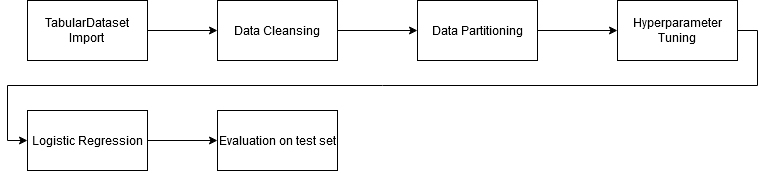
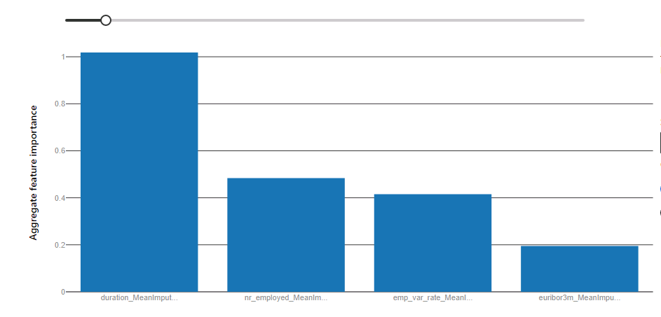

# Optimizing an ML Pipeline in Azure

## Overview
This project is part of the Udacity Azure ML Nanodegree.
In this project, we build and optimize an Azure ML pipeline using the Python SDK and a provided Scikit-learn model.
This model is then compared to an Azure AutoML run.

## Summary
This dataset is related with a direct marketing campaigns of a Portuguese bank (1). We seek to predict if a customer will subscribe 
a term deposit. Knowing this information saves the banking company a lot of time and money because only customers with a high likelihood
of subscribing to the bank product are contacted via phone and informed about the term deposit. (1) 
We will compare a hyperparameter-tuned scikit-learn logistic regression model to a classification model created by Azure AutoML in this project.

The best performing model was a VotingEnsemble created by Azure AutoML which uses SparseNormalizer, MaxAbsScaler, StandardScaler as scalers and the classification algorithms XGBoost, LightGBM and logistic regression.

## Scikit-learn Pipeline

In this section I describe the pipeline architecture using the scikit-learn logistic regression classifier, which is displayed in the following flowchart.

.

First the data is loaded from a csv file into TabularDataset. We use TabularDatasetFactory's from_delimited_files method for this task by specifying 
the URL where the csv file is located as a parameter of this function. After that the data set is cleaned using the clean_data function provided by Udacity. Now the dataset is splitted into a 
training set and a test set using the train_test_split function by scikit-learn. 

Before we could start hyperparameter tuning we have to set up a train.py script which is executed each hyperdrive run. In this script we load the data, clean and split it into train and test sets 
and train the scikit-learn logistic regression algorithm using parameters obtained from the arguments of the training script.
After the training process the performance of the classification on the test set is evaluated and appended to a log file. 

In the jupyter notebook where we manage the experiments, we create an SKLearn estimator by specifying the directory and name of the training script created in the last step and the compute target where the compution should be executed. 
Errors in earlier runs made it neccessary to specify pyarrow and pyspark as additional pip modules, so that these modules are added to the docker container created by AzureML when executing the pipeline.

The hyperdrive configuration consist of a hyperparameter sampling strategy  and an early stopping policy. The hyperparameter strategy defines how values for the hyperparameters are generated. The early stopping ploicy is used to stop runs
with a lower performance to save cost and time.

In my experiments I used RandomParameterSampling as hyperparameter sampling strategy, because it is computationally efficient and offers a good chance to find the optimum compared to a grid search. Another parameter sampler 
is BayesianParameterSampling, but this strategy does not support early stopping, because it uses former runs to improve the hyperparameter sampling results.

The next important parameter of the Hyperdrive configuration is the early stopping policy. I chose the BanditPolicy with a delay of three runs and a slack_factor of 1%. The policy is checked each run.
The Bandit Policy cancels a run if the difference of the specified metric of this run to the best run is higher than 1%. This leads to quicker computation times and lower expenses because runs with a smaller performance are stopped.

The last step is the submission  of the experiment by passing the hyperdrive config as an argument to the submit method of the experiment object. We could see the results using the 
RunDetails class. As you can see in the model output in the jupyter notebook the best hyperdrive run has an accuracy of 0.9163 and uses 0.85 as inverse regularization parameter C and sets the number of maximum iterations to 200.
The best model is saved using joblib and registered in Azure.

## AutoML
AutoML allows us to automatically train multiple models and their hyperparameters which are compared using the metric specified. To use AutoML an AutoML config has to be specified. In this configwe specify that 
SVMs should be blocked because it takes too much time to train them. 
The best model returned by AutoML is a Voting Ensemble method which means that multiple models are used to determine the class prediction for each instance. This practice is called ensemble method.
The TOP3 important features used by the VotingEnsemble model are the duration (duration of last call in seconds), the number of employees and the employment variation rate as you could see in the following plot.
.
The models involved in the VotingEnsemble are XGBoost, LightGBM and logistic regression. The predictions of each model are combined using a optimized set of weights. In the following I will provide some information about the parameters of the classification algorithms XGBoost and LightGBM.
XGBoost uses gradient boosting to optimize decision trees. By training new models based on the errors of prior trained models, they obtain a great performance.
The XGBoost classifier trained by AutoML uses this set of parameters (2):

| parameter | value | description |
|-----------|-------|-------------|
base_score  | 0.5   | initial prediction score, default 0.5 |
booster     | gbtree | type of models used for boosting. gbtree = Decision trees |
colsample_bylevel | 1 | ratio of sampled columns per level |
colsample_bynode| 1 | ratio of sampled columns for each node of the tree |
colsample_bytree| 1 | ratio of sampled columns in the tree |
eta| 0.3 | step size shrinkage, used to prevent overfitting |
gamma| 5 | minimum loss reduction, larger values make the algorithm more conservative |
grow_policy| lossguide | specifies how the tree is built, lossguide: split tree at nodes with highest difference in loss |
learning_rate| 0.1 | step size shrinkage, used to prevent overfitting |
max_bin | 63 | used when tree_method is hist, maximum amount of bins in histogram |
max_delta_step| 0 | maximum change for leaf output, 0 = no constraints |
max_depth| 10 | max depth of decision tree |
max_leaves| 0 | maximum number of leaves, 0 = no limit |
min_child_weight| 1 | minimum weight of a child node |
missing| nan | how to impute missing values in the dataset |
n_estimators| 25 | number of trees |
n_jobs| 1 | number of parallel threads|
nthread| None | number of threads |
objective| reg:logistic | learning task (i.e. classification, regression  including error| 
random_state| 0 | random seed | 
reg_alpha| 1.5625 | L1 regularization on weights |
reg_lambda| 0.10416666666666667 | L2 regularization on weights |
scale_pos_weight| 1 | controls balance of positive and negative weights (useful for imbalanced datasets) |
seed| None | random seed |
subsample| 0.7 | ratio of training instances used in training process |
tree_method| hist | method to construct the decision tree, hist means construction of trees using efficient algorithm based on histograms|

An interesting observation is that the parameter set of the XGBoostClassifier includes the parameter eta and learning_rate. As stated in the documentation (2), learning rate is an alias for eta. 

Another model involved in the VotingEnsemble classifier created by AutoML is a LightGBM with the parameter set outlined in the table below. This classification algorithm is also a gradient boosting algorithm. The difference to XGBoost is a higher speed of computation.
To obtain better efficiency, the algorithm uses histogram based algorithms to perform a binning of continuous features (3).

|parameter | value | description|
| ---------|-------|------------|
boosting_type | gbdt | type of boosting, gbdt = Gradient Boosted Decision Trees |
class_weight | None | weight for each class, not used here |
colsample_bytree | 1.0 | ratio of subsampled columns in the tree |
importance_type | split | measure of importance of features |
learning_rate 0.1 | learning rate for boosting | 
max_depth | -1 | maximal depth of tree, -1 no limit |
min_child_samples | 20 | minimal number of instances in child node | 
min_child_weight | 0.001 | minimal weight needed in child node |
min_split_gain | 0.0 | minimal loss reduction required for a new split |
n_estimators | 100 | number of trees |
n_jobs | 1 | number of parallel threads | 
num_leaves | 31 | maximum number of leaves for each tree |
objective |  None | task to learn | 
random_state | None | random seed |
reg_alpha | 0.0 | L1 regularization on weights |
reg_lambda | 0.0 | L2 regularization on weights | 
silent | True | prints messages while running boosting process |
subsample | 1.0 | ratio of training instances used in training process | 
subsample_for_bin |  200000 | number of samples for constructing bins for histogram, default 200000 |
subsample_freq | 0 | how often the dataset is subsampled, 0 means no subsampling |

## Pipeline comparison
The difference in accuracy between the best hyperparameter-tuned scikit-learn logistic regression model and the Voting Ensemble model from AutoML is very small (0.9163 vs. 0.9167). In my opinion this difference is neglectable and occurs due to randomness.
The major difference in architecture of the two models is that the logistic regression uses only one model to decide if a person will subscribe to the term deposit and the AutoML model uses multiple models for this purpose. Their predictions are aggregated using a majority vote principle.
 

## Future work
As you could see in the output of the AutoML run the dataset is imbalanced which influences the model performance negatively. To get rid of this influence you could under- or oversample the dataset using SMOTE or another sampling algorithm. 
By resampling the dataset the distribution of the target will be equal. The model performance increases because the model is trained on a dataset without a minority class.

Another area of improvement lies in the choice of the primary metric. Accuracy is calculated by dividing the correct classified instances by the number of total instances. Because of that 
imbalanced datasets lead to a high accuracy value. If you use a more robust metric like the area under curve (AUC), the area under the precision recall curve (AUPRC) or the f_1 metric you will get an 
unbiased information about the performance of your model.

The last point I want to elaborate on is the high correlation between the feature duration and the target variable class, which is referenced here https://archive.ics.uci.edu/ml/datasets/Bank+Marketing
The high correlation could lead to a overestimation of model performance. In addition the duration of the contact is not known before the call, so that variable is not helpful when predicting the output 
on customers. Because of these reasons I would exclude this variable in further experiments.

## Resources
(1) Dua, D. and Graff, C. (2019). UCI Machine Learning Repository [http://archive.ics.uci.edu/ml]. Irvine, CA: University of California, School of Information and Computer Science.  (https://archive.ics.uci.edu/ml/datasets/Bank+Marketing)
(2) XGBoost documentation from https://xgboost.readthedocs.io/en/latest/parameter.html
(3) LightGBM documentation from https://lightgbm.readthedocs.io/en/latest/