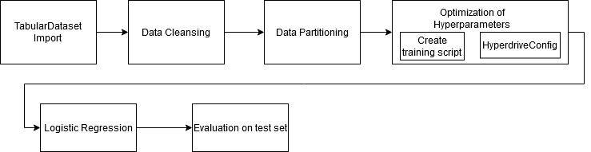
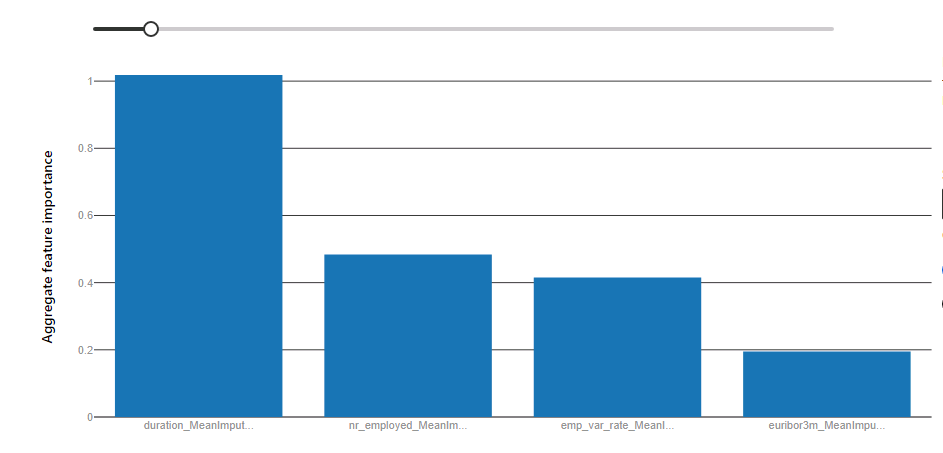

# Optimizing an ML Pipeline in Azure

## Overview
This project is part of the Udacity Azure ML Nanodegree.
In this project, we build and optimize an Azure ML pipeline using the Python SDK and a provided Scikit-learn model.
This model is then compared to an Azure AutoML run.

## Summary
This dataset is related with a direct marketing campaigns of a Portuguese bank. We seek to predict if a customer will subscribe 
a term deposit. Knowing this prediction saves the banking company a lot of time and money because only customers with a high likelihood
of subscribing to the bank product are contacted via phone and informed about the term deposit. 
To obtain our prediction we will compare a hyperparameter-tuned scikit-learn logistic regression model to a classification model created by Azure AutoML.

The best performing model is a hyperparameter-tuned logistic regression with a inverse regularization strength (C) of 0.73 and 300 maximal iterations (max_iter).

## Scikit-learn Pipeline

In this section I describe the pipeline architecture using the scikit-learn logistic regression classifier, which is displayed in the following flowchart.
.
First the data is loaded from a csv file located in the Internet into TabularDataset. We use TabularDatasetFactory's from_delimited_files method for this task by specifying 
a URL of the csv file as a parameter of the function. After that the data set is cleaned using the clean_data function supplied by Udacity. Now the dataset is divided into a 
training set and a test set using the train_test_split function by scikit-learn. 

Before we could start with hyperparameter tuning we have to set up a train.py script which is executed each hyperdrive run. Here we load the data, clean and divide it into train and test sets 
and train the scikit-learn logistic regression algorithm using parameters supplied as arguments of the training script.
After the training process the performance of the classification on the test set is evaluated and stored in a log file. 

In the jupyter notebook we create an SKLearn estimator specifying the directory and name of the training script created in the last step and the compute target where the compution should be executed. 
Because of errors in earlier runs it is neccessary to specify pyarrow and pyspark as additional pip packages, which are added to the docker container created by AzureML when executing the pipeline.

You have to specify a hyperparameter sampling strategy to sample the hyperparameters and an early stopping policy to stop runs with a bad performance.
I used RandomParameterSampling as hyperparameter sampling strategy, because it is computationally efficient and offers a good chance to find the optimum compared to a grid search. Another parameter sampler 
is BayesianParameterSampling, but this strategy does not support early stopping, because it uses former runs to improve the hyperparameter sampling.

The next important parameter of the Hyperdrive configuration is the early stopping policy. Here I chose the BanditPolicy with a delay of three runs and a slack_factor of 1%.
The bandit policy cancels a run if the difference of the specified metric of this run to the best run is higher than 1%. This leads to quicker computation times and lower expenses because runs with a smaller performance are stopped.

As the last step the experiment is submitted by passing the hyperdrive config as an argument to the submit method of the experiment object. We could see the results using the 
RunDetails class. As you can see in the model output in the jupyter notebook the best hyperdrive run has an accuracy of 0.9163 and uses 0.73 and 300 as hyperparameters for C and max_iter.
The best model is saved using joblib and registered in Azure.

## AutoML
AutoML allows us to automatically train multiple models and their hyperparameters which are compared using the metric specified. To use AutoML an AutoML config has to be specified. In this configwe specify that 
SVMs should be blocked because it takes too much time to train them. 
The best model returned by AutoML is a Voting Ensemble method which means that multiple models are used to determine the class of each instance. This practice is called ensemble methods.
The TOP3 important features are the duration (duration of last call in seconds), the number of employees and the employment variation rate as you could see in the following plot.

## Pipeline comparison
The difference in accuracy between the best hyperparameter-tuned scikit-learn logistic regression model and the Voting Ensemble model from AutoML is very small (0.9163 vs. 0.9161). In my opinion this difference is neglectable and occurs due to randomness.
The major difference in architecture of the two models is that the logistic regression uses only one model to decide if a person will subscribe to the term deposit and the AutoML model uses multiple models for this purpose. Their predictions are aggregated using a majority vote principle.
 

## Future work
As you could see in the output of the AutoML run the dataset is imbalanced which influences the model performance negatively. To get rid of this influence you could under- or oversample the dataset. 
By resampling the dataset the distribution of the target will be equal. The model performance increases because the model is trained on a dataset without a minority class.

Another area of improvement lies in the choice of the primary metric. Accuracy is calculated by dividing the correct classified instances by the number of total instances. Because of that 
imbalanced datasets lead to a high accuracy value. If you use a more robust metric like the area under curve (AUC), the area under the precision recall curve (AUPRC) or the f_1 metric you will get an 
unbiased information about the performance of your model.

The last point I want to elaborate on is the high correlation between the feature duration and the target variable class, which is referenced here https://archive.ics.uci.edu/ml/datasets/Bank+Marketing
The high correlation could lead to a overestimation of model performance. In addition the duration of the contact is not known before the call, so that variable is not helpful when predicting the output 
on customers. Because of these reasons I would exclude this variable in further experiments.

